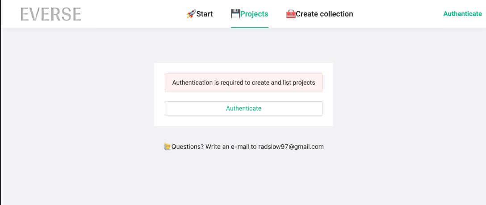
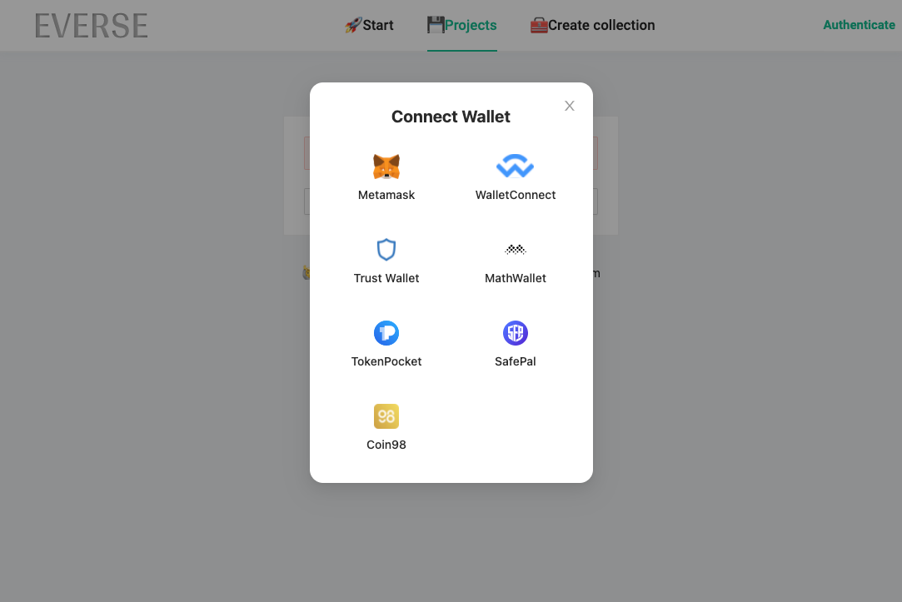
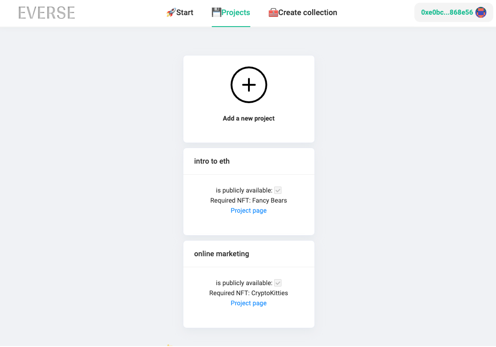
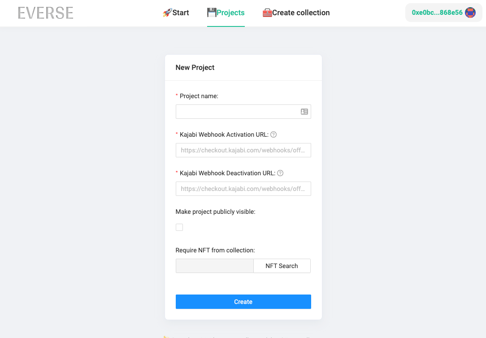
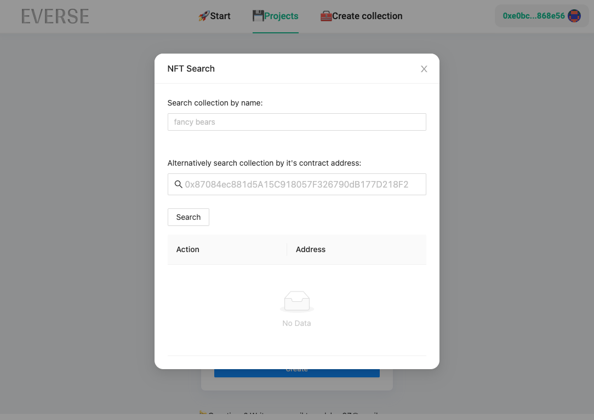
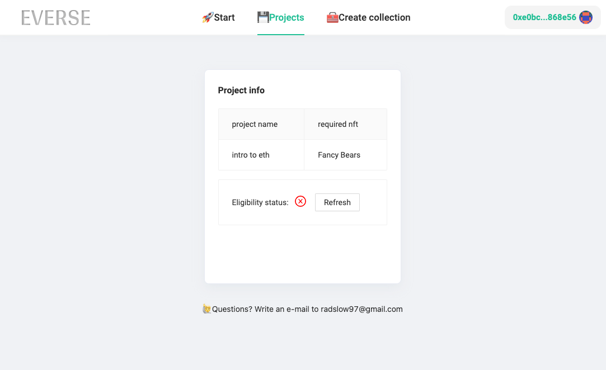
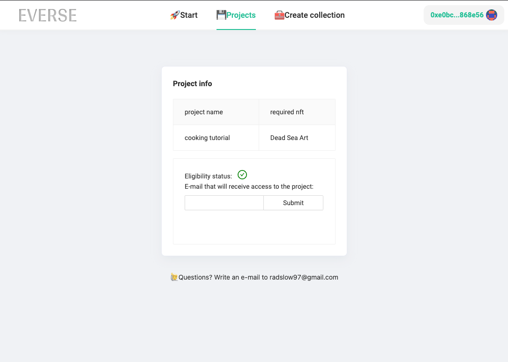

Project based on https://github.com/ethereum-boilerplate/ethereum-boilerplate

With this app you can grant access for your Kajabi content based on NFT collection ownership of your choice. E.g. You
want your course to be available to all owners of *CryptoPunks*. Owner of CryptoPunk can redeem (one) access to your
Kajabi product. When CryptoPunk is sold and someone else redeems access to content to Kajabi product then previous
access is revoked so that there is always up to 1 access for particular CryptoPunk.

In progress: minting own NFT collection.

